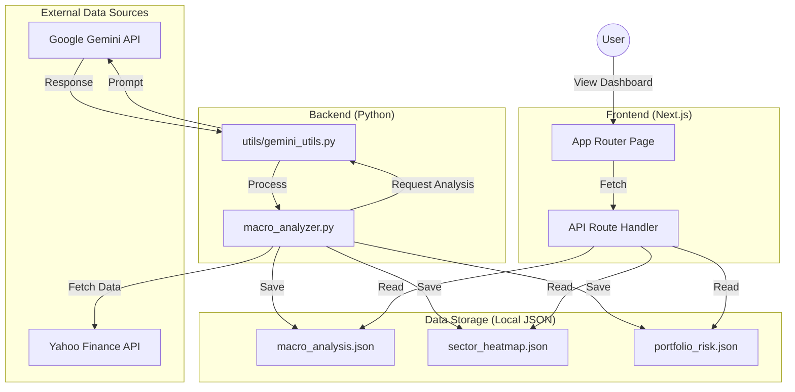

# System Architecture (v1.0)
**Date:** 2026-02-17
**Author:** VibeAlgoLab

## 1. Architecture Overview
This project follows a **Local-First Architecture**. Data processing (Python) and visualization (Next.js) are loosely coupled via the local file system (JSON).

## 2. Data Flow Diagram

## 3. Key Component Interaction
1.  **Macro Analysis:** `macro_analyzer.py` collects data from external APIs.
2.  **AI Insight:** Gemini API generates a market summary based on collected data.
3.  **Visualization:** Next.js reads stored JSON files and renders components like `RichText` and `Heatmap`.

---
*This diagram helps visualize the entire system structure at a glance.*
